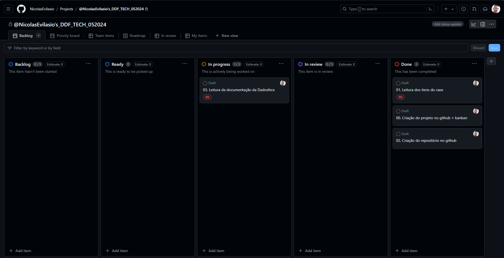

## Case técnico para Engenharia de Dados na empresa Dadosfera

[Clique aqui para acessar o vídeo de apresentação do case](https://google.com.br)
___
### Item 0 - Sobre Agilidade e Planejamento
Neste case técnico, abordaremos o desenvolvimento de um projeto de Engenharia de Dados na empresa Dadosfera. Para garantir o sucesso do projeto, seguiremos as melhores práticas do PMBOK (Project Management Body of Knowledge).

``Clique no Kanban (imagem) abaixo para ser encaminhado à pagina com o projeto``
___
### Item 1 - Sobre a Base de Dados
Seguindo o cenário proposto na definição do Case, pesquise e sugira uma base de dados para fazer todo case ponta a ponta.

Base de dados escolhida:
[Base de Produtos e suas descrições](https://huggingface.co/datasets/spacemanidol/product-search-corpus)

___
### Item 2.1 - Sobre a Dadosfera - Integrar
Utilizando o módulo de Coleta da Dadosfera, conecte a sua base de dados proposta e suba esses dados para a Plataforma.

Bonus: Para bases de dados Transacionais, temos a feature de Microtransformação. Carregue seus dados numa base transacional SQL, importe para a Dadosfera e aplique uma microtransformação.

- Utilização da lib datasets para carregar o dataset 
- Transformação do dataset em um df pandas
- Carga para uma instância do Amazon RDS (PostgreSQL)  

[Script Python]()

___