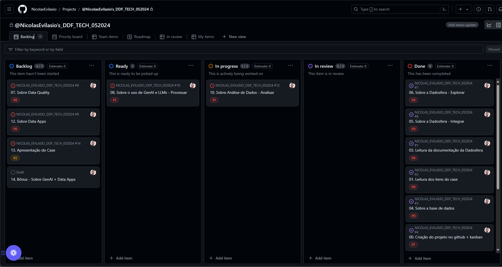

## Case técnico para Engenharia de Dados na empresa Dadosfera

___
### Item 0 - Sobre Agilidade e Planejamento
Neste case técnico, abordaremos o desenvolvimento de um projeto de Engenharia de Dados na empresa Dadosfera. Para garantir o sucesso do projeto, seguiremos as melhores práticas do PMBOK (Project Management Body of Knowledge).

``Clique no Kanban (imagem) abaixo para ser encaminhado à pagina com o projeto``
___
### Item 1 - Sobre a Base de Dados
Seguindo o cenário proposto na definição do Case, pesquise e sugira uma base de dados para fazer todo case ponta a ponta.

Base de dados escolhida:
[Microsoft AdventureWorks2022](https://learn.microsoft.com/pt-br/sql/samples/adventureworks-install-configure?view=sql-server-ver16&tabs=ssms)

___
### Item 2.1 - Sobre a Dadosfera - Integrar
Utilizando o módulo de Coleta da Dadosfera, conecte a sua base de dados proposta e suba esses dados para a Plataforma.

Bonus: Para bases de dados Transacionais, temos a feature de Microtransformação. Carregue seus dados numa base transacional SQL, importe para a Dadosfera e aplique uma microtransformação.

- Utilização da lib datasets para carregar o dataset 
- Transformação do dataset em um df pandas
- Carga para uma instância do Amazon RDS (PostgreSQL)  

[Script Python]()
___
### Item 3 - Sobre a Dadosfera - Explorar
Usando os seus conhecimentos da documentação da Dadosfera, faça a carga desse dataset, catalogue-o com as informações mais relevantes, seguindo boas práticas de Dicionário de Dados.  

#### Links dos ativos gerados:
[DimReseller](https://app.dadosfera.ai/pt-BR/catalog/data-assets/f4fdeb59-c558-4bf3-811f-538087a3b34a)  
[DimDate](https://app.dadosfera.ai/pt-BR/catalog/data-assets/4d70fdf7-5fbe-4d7e-8703-6ef1ee59736e)   
[DimSalesTerritory](https://app.dadosfera.ai/pt-BR/catalog/data-assets/9da9149b-6a90-4e8d-88a8-df0b989eafef)  
[DimProduct](https://app.dadosfera.ai/pt-BR/catalog/data-assets/81fb3463-f049-42ba-ab88-b4a48c2d97d6)   
[FactResellerSales](https://app.dadosfera.ai/pt-BR/catalog/data-assets/dd0ad643-c928-421f-b909-d155cc1deeb1)

`Visão Geral`

`Prévia`

`Documentação`

___
### Item 5 - Sobre o uso de GenAI e LLMs - Processar
Um dos Datasets sugeridos acima é uma lista Produtos e suas respectivas descrições. Esse Dataset tem aproximadamente de 3Gbs de Dados JSON e tem 2 colunas de texto, uma de título e outra de descrição.

Nesta etapa do case, queremos avaliar sua capacidade de transformar dados desestruturados em Features para análise.

Traga um dataset desestruturado e, utilizando IA, gere features em cima desses dados.

Criei um app no streamlit que, utilizando a openai API, é capaz de receber um texto com título e decrição do produto e retorna o dado estruturado em json.

`Clique no gif abaixo para abrir o app`

___
### Item 6 - Sobre Modelagem de Dados

Escolhi a modelagem dimensional no esquema estrela, utilizando a metodologia Kimball.

**FactResellerSales:**
- É a tabela fato central, que contém as métricas de vendas e chaves estrangeiras que se conectam às tabelas de dimensões.

**DimDate, DimReseller, DimProduct, DimSalesTerritory:**
- São as tabelas de dimensões que armazenam atributos relacionados a datas, revendedores, produtos e territórios de vendas, respectivamente.

**Relacionamentos:**
- Cada tabela de dimensão está conectada à tabela fato por meio de chaves, como DateKey, ResellerKey, ProductKey e SalesTerritoryKey.

**Modelagem Kimball:**
- **Foco no Processo de Negócios:** A modelagem Kimball prioriza os processos de negócios e a facilidade de compreensão para os usuários finais.
- **Esquema de Estrela:** Utiliza o esquema de estrela para organizar as tabelas fato e dimensões, facilitando as consultas e análises.
- **Desempenho:** Projetado para otimizar o desempenho em operações de consulta, especialmente em sistemas de BI.

